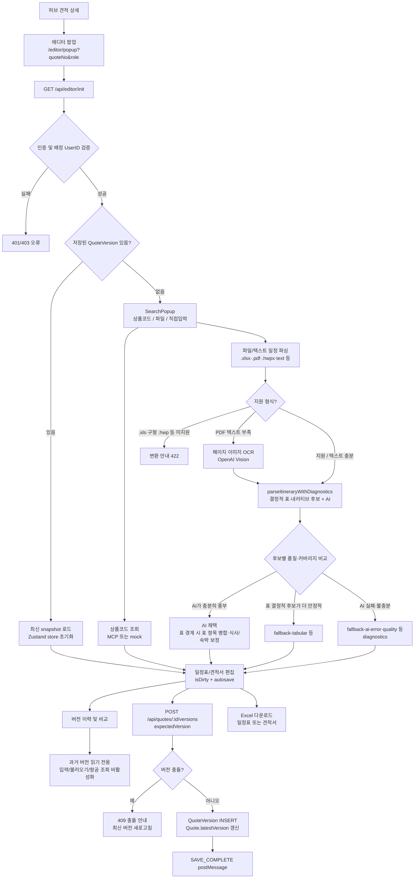
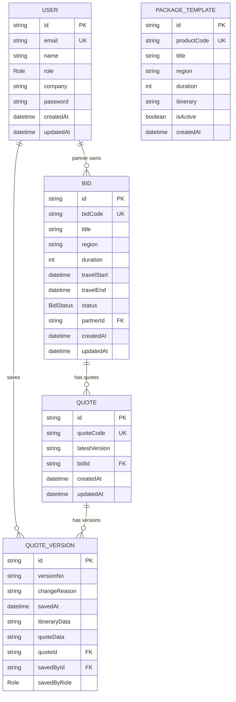

# Tour Editor

하나투어 견적·일정 에디터입니다. 하나투어 허브의 견적 상세 화면에서 팝업으로 실행되는 Next.js 애플리케이션이며, 상품 일정 조회, 일정표 편집, 견적서 편집, 버전 저장, 버전 비교, Excel 다운로드를 제공합니다.

## Quick Start

```bash
npm install
cp .env.example .env.local
npm run db:migrate
npm run db:seed
npm run dev
```

개발 서버는 기본적으로 `http://localhost:3000`에서 실행됩니다. 루트(`/`)는 로그인 상태 확인 화면이고, 실제 에디터는 팝업 URL(`/editor/popup?quoteNo=...&role=...`)로 진입합니다.

## Commands

| Command | Description |
| --- | --- |
| `npm run dev` | Next.js 개발 서버 실행 |
| `npm run build` | 프로덕션 빌드 |
| `npm run start` | 빌드 결과 실행 |
| `npm run typecheck` | TypeScript 타입 검사 |
| `npm run lint` | Next.js/ESLint 검사 |
| `npm run test` | Vitest 단위 테스트 실행 |
| `npm run test:e2e` | Playwright E2E 테스트 실행 |
| `npm run quality` | 타입, 린트, 테스트 품질 게이트 실행 |
| `npm run db:migrate` | Prisma migration 적용 |
| `npm run db:generate` | Prisma client 생성 |
| `npm run db:studio` | Prisma Studio 실행 |
| `npm run db:seed` | 개발용 seed 데이터 생성 |
| `npm run db:reset` | DB reset 후 seed 재실행 |

## Tech Stack

| Area | Stack |
| --- | --- |
| Language | TypeScript strict |
| Framework | Next.js 15 App Router |
| UI | React 19, Tailwind CSS, Radix-style local UI components, lucide-react |
| State | Zustand, TanStack Query |
| Auth | NextAuth v5 Credentials provider, JWT session |
| Database | Prisma ORM, SQLite for local development |
| Test | Vitest, Playwright |
| Excel | ExcelJS, centralized through `src/lib/excel/` |
| Integration | MCP sale product API with mock fallback |
| Date Policy | Korea business date utilities in `src/lib/date/korea.ts` |

## Why This Stack

| Decision | Reason |
| --- | --- |
| TypeScript strict | 일정표와 견적서 데이터는 중첩 구조가 깊고 금액/날짜/역할에 따른 분기가 많습니다. strict 타입을 사용해 저장 전 데이터 shape 오류와 역할 처리 실수를 컴파일 단계에서 줄입니다. |
| Next.js App Router | 화면, API, 인증 boundary를 한 프로젝트 안에서 관리할 수 있습니다. 팝업 기반 업무 앱이라 별도 BFF를 두기보다 App Router API route가 현재 규모에 맞습니다. |
| React 19 | 복잡한 편집 UI를 컴포넌트 단위로 분리하기 좋고, Next.js 15와 호환되는 기본 UI 런타임입니다. |
| Tailwind CSS | 업무 화면 특성상 반복되는 폼, 표, 패널 UI가 많습니다. Tailwind는 별도 CSS 파일 이동 없이 컴포넌트 근처에서 빠르게 레이아웃을 조정할 수 있습니다. |
| Zustand | 에디터의 핵심 상태는 `itinerary`, `quote`, `isDirty`처럼 작고 명확합니다. Redux 수준의 보일러플레이트보다 가벼운 store가 적합합니다. |
| TanStack Query | 팝업 초기화, 버전 조회, 외부 데이터 조회처럼 서버 상태와 클라이언트 편집 상태를 분리해야 합니다. 서버 cache/fetch 상태는 Query가 담당하고, 편집 중인 draft는 Zustand가 담당합니다. |
| NextAuth | 현재는 Credentials 기반 개발 인증이지만, 세션/JWT/callback 구조가 있어 향후 하나투어 허브 계정 연동으로 교체하기 쉽습니다. |
| Prisma | `User`, `Bid`, `Quote`, `QuoteVersion` 관계가 명확한 relational model입니다. Prisma schema와 generated type을 통해 DB 접근을 타입 안전하게 유지합니다. |
| SQLite for local | 개발자가 DB 서버 없이 바로 실행할 수 있습니다. 운영 환경에서는 PostgreSQL 전환을 전제로 합니다. |
| Vitest | 순수 도메인 함수 테스트가 많고 Vite 기반 실행이 빠릅니다. 일정 파싱, 버전 번호, Excel 파일명 같은 로직 검증에 적합합니다. |
| Playwright | 실제 브라우저에서 팝업, 저장, 권한, Excel 다운로드처럼 통합 흐름을 검증해야 하므로 E2E 테스트가 필요합니다. |
| ExcelJS | 결과물이 업무용 Excel 파일이므로 cell merge, style, worksheet 제어가 필요합니다. ExcelJS를 `src/lib/excel/`에 격리해 UI와 파일 생성 책임을 분리합니다. |
| Mock fallback | MCP, 항공, 원가 연동은 외부 의존성이므로 개발/테스트 안정성을 위해 mock을 기본값으로 둡니다. 실제 연동 장애가 에디터 개발을 막지 않게 합니다. |
| Korea date utilities | 여행 일정과 파일명은 한국 업무일 기준이어야 합니다. 런타임 timezone 차이로 날짜가 하루 밀리는 문제를 막기 위해 `Asia/Seoul` 유틸을 표준으로 둡니다. |

## Project Structure

```text
.
├── prisma/
│   ├── schema.prisma          # Prisma schema, currently SQLite
│   └── seed.ts                # 개발용 계정/견적/버전 seed
├── src/
│   ├── app/                   # Next.js App Router pages and API routes
│   │   ├── (popup)/           # 팝업 전용 에디터 route group
│   │   ├── api/               # 서버 API routes
│   │   ├── login/             # NextAuth credentials login page
│   │   └── page.tsx           # 로그인 상태 확인/안내 화면
│   ├── components/
│   │   ├── editor/            # 일정표, 견적서, 저장, 버전, 검색 UI
│   │   └── ui/                # 공통 UI primitive
│   ├── hooks/                 # editor store, popup init, autosave hooks
│   ├── lib/
│   │   ├── date/              # Asia/Seoul 날짜 유틸
│   │   ├── excel/             # Excel workbook/filename/logo 생성
│   │   ├── itinerary/         # 일정 파싱, 표시, 정책, 변경 로직
│   │   ├── mcp/               # MCP 상품 조회와 일정 데이터 매핑
│   │   ├── quote/             # 견적서 생성/통화 계산
│   │   ├── version/           # 버전 생성, 번호 생성, diff
│   │   ├── auth.ts            # NextAuth 설정
│   │   ├── config.ts          # 환경변수 단일 접근 지점
│   │   └── db.ts              # Prisma client singleton
│   ├── mocks/                 # 상품/항공/원가 mock data
│   └── types/                 # 공통 도메인 타입
├── e2e/                       # Playwright 시나리오(팝업·저장·권한·골든 일정 가져오기 등)
├── tests/fixtures/itinerary-golden/  # 일정 파싱 회귀용 골든 파일
├── docs/                      # PRD, DB schema, Excel spec, MCP mapping, diagrams/
└── scripts/quality-gate.sh    # 품질 게이트(typecheck·lint·test + 에디터 TSX 규칙)
```

## Overall Flow



세부 시퀀스와 역할별 흐름은 `docs/diagrams/sequence_diagram.puml`, `docs/diagrams/role_flows.puml`에 있습니다.

## Runtime Flow

```text
Hub estimate page
  -> opens popup /editor/popup?quoteNo=...&role=...
  -> EditorShell
  -> usePopupInit
  -> GET /api/editor/init?quoteNo=...
  -> Prisma loads Quote + latest QuoteVersion
  -> Zustand editor store initializes itineraryData and quoteData
```

새 견적이거나 저장된 버전이 없으면 검색 팝업을 열어 상품코드 기반 일정 데이터를 불러옵니다. 상품 조회는 기본적으로 mock을 사용하며, `USE_MOCK_MCP=false`일 때 MCP 서버를 호출하고 실패 조건에 따라 mock fallback을 사용합니다.

저장 흐름은 다음과 같습니다.

```text
EditorShell SaveModal
  -> POST /api/quotes/:id/versions
  -> src/lib/version/createVersion.ts
  -> optimistic version check
  -> QuoteVersion INSERT
  -> Quote.latestVersion UPDATE
  -> postMessage SAVE_COMPLETE to parent window
```

Excel 다운로드 흐름은 다음과 같습니다.

```text
Preview or saved version
  -> /api/quotes/:id/export?type=itinerary|cost
  -> src/lib/excel/generateItinerary.ts or generateCostSheet.ts
  -> xlsx response
```

## Architecture

이 프로젝트는 작은 모놀리식 Next.js 애플리케이션이지만, 내부는 App, Domain, State, Data 계층으로 나눕니다. 이유는 팝업 UI와 업무 규칙, DB 저장 규칙이 강하게 얽히면 버전 불변식이나 Excel 출력 규칙이 쉽게 깨지기 때문입니다. Next.js 안에서 배포 단위는 단순하게 유지하되, 코드 책임은 명확히 분리하는 설계입니다.

### App Layer

`src/app/`는 라우팅과 서버 boundary를 담당합니다. API route는 인증 확인 후 `src/lib/`의 도메인 함수로 위임합니다. 팝업 에디터는 `src/app/(popup)/editor/popup/EditorShell.tsx`가 조립하며, 화면 단위 컴포넌트는 `src/components/editor/`에 둡니다.

이 계층은 HTTP, session, request/response 변환만 책임집니다. 이렇게 해야 인증 누락, 역할 검증 누락, 잘못된 status code 같은 서버 boundary 문제를 API route에서 한 번에 검토할 수 있습니다.

### Domain Layer

핵심 업무 로직은 `src/lib/`에 있습니다. 일정표 로직은 `itinerary`, 견적서 계산은 `quote`, 버전 정책은 `version`, Excel 생성은 `excel`, 외부 상품 연동은 `mcp`에 분리되어 있습니다. 컴포넌트에서 Prisma나 ExcelJS를 직접 호출하지 않고 API route와 lib 함수를 경유합니다.

이 설계의 핵심은 업무 규칙을 UI에서 분리하는 것입니다. 예를 들어 버전 생성은 `createVersion.ts`, 날짜 계산은 `date/korea.ts`, Excel 생성은 `excel/`에 고정되어 있으므로 화면이 바뀌어도 핵심 불변식은 한 곳에서 유지됩니다.

### State Layer

클라이언트 편집 상태는 `src/hooks/useEditorStore.ts`의 Zustand store가 관리합니다. `itinerary`, `quote`, `isDirty`가 주요 상태이며, 서버 저장 전까지는 클라이언트 임시 상태로 유지됩니다. `useAutoSave`는 미저장 편집 상태를 복구할 수 있도록 보조합니다.

서버에 저장된 버전 데이터와 사용자가 현재 편집 중인 draft는 성격이 다릅니다. 저장된 데이터는 API와 DB가 source of truth이고, 편집 중 데이터는 브라우저 store가 source of truth입니다. 이 둘을 분리해야 미저장 변경, 저장 충돌, 읽기 전용 버전 보기 같은 상태를 안전하게 처리할 수 있습니다.

### Data Layer

모든 DB 접근은 `src/lib/db.ts`의 Prisma client singleton을 통해 수행합니다. 현재 `prisma/schema.prisma`는 `provider = "sqlite"`이고 `.env.local`의 `DATABASE_URL="file:./dev.db"`를 사용합니다. 운영 DB로 전환할 때는 PostgreSQL provider와 connection URL을 함께 변경해야 합니다.

DB 접근 지점을 하나로 제한하는 이유는 연결 관리와 쿼리 정책을 통제하기 위해서입니다. 특히 `QuoteVersion`은 append-only 규칙이 있으므로, 임의의 Prisma client나 산발적인 raw query가 늘어나면 버전 불변식을 추적하기 어려워집니다.

### Boundary Rules

| Boundary | Rule | Reason |
| --- | --- | --- |
| UI -> API | UI는 서버 역할 값을 신뢰하지 않고 API가 다시 인증/권한을 확인합니다. | 클라이언트 값은 조작 가능하므로 저장 권한 같은 보안 결정을 맡기지 않습니다. |
| API -> Domain | API route는 검증과 응답 변환을 맡고, 업무 로직은 `src/lib/`로 위임합니다. | 같은 업무 규칙을 여러 route나 화면에서 재사용하고 테스트하기 위함입니다. |
| Domain -> DB | DB query는 `src/lib/db.ts`의 `db`를 통해 수행합니다. | Prisma client lifecycle과 DB 접근 패턴을 일관되게 유지합니다. |
| UI -> Excel | 컴포넌트에서 ExcelJS를 직접 호출하지 않습니다. | 파일 포맷은 업무 산출물이므로 UI 변경과 독립적으로 관리해야 합니다. |
| Date -> Display/Storage | 업무 날짜는 `src/lib/date/korea.ts`를 사용합니다. | 서버/브라우저 timezone 차이로 일정일이 틀어지는 문제를 방지합니다. |

## Domain Model

| Model | Purpose |
| --- | --- |
| `User` | 로그인 사용자, 역할, 협력사 정보 |
| `Bid` | 견적 요청 단위 |
| `Quote` | 견적서와 일정표의 논리적 묶음, 최신 버전 번호 보관 |
| `QuoteVersion` | 일정표와 견적서 JSON snapshot, append-only version record |
| `PackageTemplate` | 상품 템플릿 검색용 데이터 |

### DB Relationship Diagram



`PackageTemplate`은 현재 다른 테이블과 직접 relation을 맺지 않는 검색/템플릿용 독립 테이블입니다. `QuoteVersion.itineraryData`, `QuoteVersion.quoteData`, `PackageTemplate.itinerary`는 SQLite 개발 환경에서는 JSON 문자열로 저장합니다.

### DB Constraints and Indexes

| Table | Constraint / Index | Purpose |
| --- | --- | --- |
| `User` | `email` unique | 로그인 식별자 중복 방지 |
| `Bid` | `bidCode` unique, `bidCode` index, `region` index | 비딩 코드 조회와 지역 검색 최적화 |
| `Quote` | `quoteCode` unique, `quoteCode` index | 허브 견적번호 기반 팝업 초기화 |
| `QuoteVersion` | unique `(quoteId, versionNo)`, `quoteId` index | 견적별 버전 중복 방지와 버전 목록 조회 최적화 |
| `PackageTemplate` | `productCode` unique, `(region, duration)` index | 상품코드 직접 조회와 지역/기간 기반 검색 |

### DB Lifecycle

```text
User(PARTNER)
  -> creates/owns Bid
  -> Bid has one or more Quote
  -> Quote points to latestVersion
  -> every save inserts a new QuoteVersion snapshot
  -> savedById records the User who saved that version
```

버전 저장 시 `QuoteVersion`은 수정하지 않고 새 row를 추가합니다. `Quote.latestVersion`은 최신 버전을 빠르게 찾기 위한 포인터이며, 실제 일정표/견적서 원본은 각 `QuoteVersion` snapshot에 저장됩니다.

주요 타입은 `src/types/index.ts`에 정의되어 있습니다.

- `ItineraryData`: 일정표 전체 snapshot
- `DaySchedule`: 일차별 일정
- `ScheduleItem`: 관광, 이동, 식사, 숙박 등 일정 항목
- `QuoteData`: 견적서 전체 snapshot. `header.writtenAt`, `header.validUntil`, `exchangeRates`, `items`, `summary`를 포함합니다.
- `QuoteItem`: 견적 항목
- `Role`: `PARTNER`, `AGENT`, `SALES`

견적서 자동 생성은 일정표의 성인 인원수를 기본 수량으로 사용합니다. 총 경비 입력은 협력사 기준 `지상비수익`과 `하나투어수익`을 분리해 저장하지만, 미리보기와 견적산출내역서 Excel에는 `여행사수수료` 행에 두 금액을 합산해 표시합니다.

일정표 에디터와 견적서 에디터는 동일한 `max-w-5xl` 본문 폭과 카드형 섹션 스타일을 사용합니다. 버전 비교 화면은 좌우 비교 배치를 유지하되 테이블을 compact하게 표시해 가로 스크롤 없이 비교하는 것을 기본으로 합니다.

## API Overview

| Route | Method | Purpose |
| --- | --- | --- |
| `/api/auth/[...nextauth]` | GET/POST | NextAuth handler |
| `/api/editor/init?quoteNo=...` | GET | 팝업 진입 시 견적과 최신 버전 조회 |
| `/api/mcp/products/:code` | GET | 상품코드로 MCP 또는 mock 일정 조회 |
| `/api/flights` | GET | 항공 mock/검색 데이터 조회 |
| `/api/itinerary/parse` | POST | 일정 파일/텍스트 파싱(PDF OCR·다중 시트 .xlsx·.hwpx 등), `parseItineraryWithDiagnostics`; `?debug=1`이면 diagnostics에 후보 점수 포함 |
| `/api/quotes/:id/versions` | GET | 버전 목록 조회 |
| `/api/quotes/:id/versions` | POST | 새 버전 생성 |
| `/api/quotes/:id/versions/:version` | GET | 특정 버전 상세 조회 |
| `/api/quotes/:id/versions/diff` | GET | 두 버전 비교 |
| `/api/quotes/:id/export` | GET/POST | 일정표 또는 견적서 Excel 생성 |

모든 `src/app/api/**` route는 서버에서 인증을 확인해야 합니다. 역할 체크도 서버에서만 수행하며, 클라이언트에서 전달된 role 값은 신뢰하지 않습니다.

## Versioning Rules

버전 생성은 반드시 `src/lib/version/createVersion.ts`를 거칩니다.

- `QuoteVersion`은 INSERT-only입니다.
- 기존 `QuoteVersion` row를 UPDATE하지 않습니다.
- 일정표와 견적서는 항상 같은 `versionNo`로 저장합니다.
- `Quote.latestVersion`만 최신 포인터로 갱신합니다.
- 저장 요청은 `expectedVersion`으로 낙관적 잠금을 수행합니다.
- `PARTNER`, `AGENT`, `SALES` 모두 배정된 Quote에 한해서 저장할 수 있습니다.

이 규칙은 이 프로젝트의 핵심 불변식입니다. 버전 저장 관련 코드를 수정할 때는 E2E의 version 시나리오를 함께 확인해야 합니다.

## Auth and Roles

인증은 `src/lib/auth.ts`의 NextAuth v5 설정을 사용합니다. 현재는 개발용 Credentials provider이며, 비밀번호는 SHA-256 hash로 비교합니다. 세션은 JWT strategy를 사용하고, `role`은 JWT와 session에 포함됩니다.

역할은 `src/types/index.ts`의 `Role` enum을 사용합니다.

| Role | Behavior |
| --- | --- |
| `PARTNER` | 협력사 사용자, 편집/저장 가능 |
| `AGENT` | 견적 담당자, 편집/저장 가능 |
| `SALES` | 영업 담당자, 최종 조정/저장 가능 |

## External Integrations

### MCP Product Lookup

`src/lib/mcp/saleProductClient.ts`가 MCP 상품 데이터를 조회하고, `src/lib/mcp/mapSaleProductToItinerary.ts`가 에디터의 `ItineraryData`로 변환합니다. `USE_MOCK_MCP=true`이면 `src/mocks/products.json`을 우선 사용합니다.

### AI Itinerary Parsing

`/api/itinerary/parse`는 `OPENAI_API_KEY`, `OPENAI_MODEL`, `OPENAI_BASE_URL` 설정을 사용합니다(키가 없으면 결정적 파싱만으로 `fallback-no-key` 등으로 동작).

- **`.xlsx`**: 시트명·내용 스코어로 일정표 시트를 우선하고, 필요 시 복수 시트(상한 있음)를 텍스트로 합친 뒤 `spreadsheetRowsToText`로 정규화합니다.
- **`.pdf`**: `pdf-parse`로 텍스트를 먼저 추출하고, 양이 부족하면 페이지를 이미지로 렌더링한 뒤 OpenAI Vision OCR을 수행합니다.
- **`.hwpx`**: ZIP 내 XML에서 텍스트를 추출합니다(확장자가 `.hwpx`이면 Excel `.xls` 검사와 별개 경로입니다).
- **미지원**: 구형 **`.xls`**, 구형 **`.hwp`**는 보안·포맷 이유로 422 안내 메시지와 함께 거절합니다.
- **선택**: `POST ...?debug=1`이면 응답 `diagnostics`에 후보별 점수(`candidateScores`) 등을 포함합니다.

핵심 로직은 `src/lib/itinerary/aiParser.ts`의 `parseItineraryWithDiagnostics`이며, Vitest 골든 회귀는 `tests/fixtures/itinerary-golden/`과 `src/app/api/itinerary/parse/itinerary-golden.test.ts`를 참고하면 됩니다.

### Excel

Excel 생성은 `src/lib/excel/`에만 위치합니다. 일정표는 `generateItinerary.ts`, 견적서는 `generateCostSheet.ts`, 파일명은 `filename.ts`에서 생성합니다. 견적서 Excel은 총 경비 섹션 아래에 `이 견적은 yyyy년 m월 d일 까지만 유효합니다` 문구를 우측 정렬로 표시합니다.

## Environment Variables

`.env.example`을 기준으로 `.env.local`을 구성합니다.

| Variable | Purpose |
| --- | --- |
| `DATABASE_URL` | Prisma DB 연결 URL |
| `NEXTAUTH_URL` | NextAuth base URL |
| `NEXTAUTH_SECRET` | JWT/session secret |
| `USE_MOCK_MCP` | MCP 대신 mock 상품 데이터 사용 여부 |
| `HANATOUR_MCP_URL` | MCP endpoint |
| `HANATOUR_MCP_TOKEN` | MCP 인증 token |
| `USE_MOCK_FLIGHTS` | 항공 mock 사용 여부 |
| `USE_MOCK_COST_REF` | 원가 mock 사용 여부 |
| `ALLOWED_PARENT_ORIGINS` | postMessage 허용 origin 목록 |
| `OPENAI_API_KEY` | 일정 AI 파싱 및 PDF OCR fallback용 API key |
| `OPENAI_MODEL` | AI 파싱 모델. PDF OCR fallback을 위해 이미지 입력 지원 모델 필요 |
| `OPENAI_BASE_URL` | AI API base URL |

프로덕션 코드에서 `process.env`를 직접 읽지 않습니다. 새 환경변수는 `src/lib/config.ts`를 통해 노출합니다.

## Development Rules

- TypeScript strict 모드를 유지합니다.
- `any` 타입을 추가하지 않습니다.
- API route는 `getApiToken()` 또는 NextAuth session 확인을 수행합니다.
- DB query는 `src/lib/db.ts`의 `db`만 사용합니다.
- 역할 문자열은 하드코딩하지 않고 `Role` enum을 사용합니다.
- 업무 날짜와 표시 날짜는 `src/lib/date/korea.ts`를 우선 사용합니다.
- `toISOString().slice(0, 10)`로 업무 날짜 문자열을 만들지 않습니다.
- 컴포넌트에서 ExcelJS를 직접 호출하지 않습니다.
- 프로덕션 코드에 `console.log`를 남기지 않습니다.

상세 규칙은 `AGENTS.md`를 기준으로 합니다.

## Testing Strategy

단위 테스트는 도메인 함수 중심입니다.

- 일정 파싱/표시/정렬: `src/lib/itinerary/*.test.ts`
- 파싱 API·골든 회귀: `src/app/api/itinerary/parse/route.test.ts`, `itinerary-golden.test.ts`(fixture: `tests/fixtures/itinerary-golden/`)
- 버전 번호: `src/lib/version/*.test.ts`
- Excel 파일명: `src/lib/excel/*.test.ts`
- MCP 매핑: `src/lib/mcp/*.test.ts`

E2E 테스트는 Playwright로 주요 사용자 흐름을 검증합니다.

- 팝업 초기화
- 역할별 권한
- 버전 생성/읽기 전용
- 일정 다중 항목
- 골든 fixture 기반 일정 가져오기(`itinerary-import-golden.spec.ts`)
- Excel 다운로드

작업 완료 전 기본 품질 게이트는 `npm run quality`(또는 동일 검사를 수동으로 돌릴 때는 아래)입니다.

```bash
npm run typecheck
npm run lint
npm run test
```

## Related Docs

| Document | Purpose |
| --- | --- |
| `AGENTS.md` | 프로젝트 작업 규칙과 금지 패턴 |
| `docs/PRD_v2.md` | 제품 요구사항 |
| `docs/DB_SCHEMA.md` | DB schema 설계 설명 |
| `docs/EXCEL_FORMAT_SPEC.md` | Excel 출력 포맷 |
| `docs/mcp-response-field-mapping.md` | MCP 응답 필드 매핑 |
| `docs/diagrams/role_flows.puml` | PARTNER, AGENT, SALES 역할별 화면/업무 흐름 |
| `docs/diagrams/sequence_diagram.puml` | 팝업 초기화, 상품 조회, 일정 파싱, 저장, Excel 다운로드 시퀀스 |
| `docs/diagrams/data_flow.puml` | 클라이언트·API·파서·DB 간 데이터 흐름 |
| `docs/diagrams/flowchart.puml` | 사용자 관점 주요 분기 플로우 |
| `docs/PROGRESS.md` | 구현 진행 기록 |
